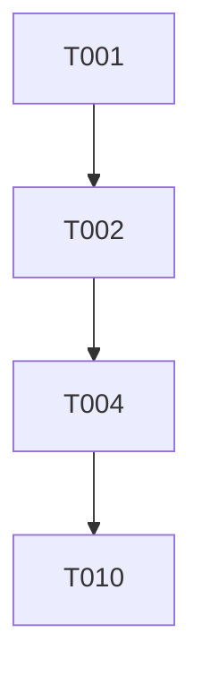

````chatagent
---
description: Convert tasks into local issue tracking files for disconnected environments (no GitHub API required).
---

## User Input

```text
$ARGUMENTS
```

You **MUST** consider the user input before proceeding (if not empty).

## Outline

This agent creates **local issue tracking files** instead of GitHub Issues, enabling full spec-driven workflow in disconnected environments.

1. Run `.specify/scripts/powershell/check-prerequisites.ps1 -Json -RequireTasks -IncludeTasks` from repo root and parse FEATURE_DIR and AVAILABLE_DOCS list. All paths must be absolute. For single quotes in args like "I'm Groot", use escape syntax: e.g 'I'\''m Groot' (or double-quote if possible: "I'm Groot").

2. From the executed script, extract the path to **tasks.md**.

3. Parse all tasks from tasks.md, extracting:
   - Task ID (T001, T002, etc.)
   - Task description
   - File path mentioned
   - Phase/section the task belongs to
   - Parallel marker [P] if present
   - User Story marker [US1], [US2], etc. if present
   - Dependencies (from the Dependencies section)

4. Create the issues directory at `FEATURE_DIR/issues/` if it doesn't exist.

5. For each task, create a local issue file with this naming convention:
   - `ISSUE-{TaskID}-{short-description}.md`
   - Example: `ISSUE-T001-create-project-structure.md`

6. Each issue file should follow this format:

```markdown
# [Task Description]

**Issue ID**: ISSUE-{TaskID}
**Status**: Open
**Created**: [DATE]
**Phase**: [Phase name from tasks.md]

## Description

[Full task description including file path]

## Labels

- [ ] phase:[phase-name]
- [x] parallel (if [P] marker present)
- [x] story:[USx] (if user story marker present)

## Dependencies

[List any dependencies from the Dependencies section]

## Acceptance Criteria

- [ ] Task completed as described
- [ ] Code follows project conventions
- [ ] Tests pass (if applicable)
- [ ] Code reviewed (if required by constitution)

## Progress Log

| Date | Status | Notes |
|------|--------|-------|
| [Created Date] | Open | Issue created from tasks.md |

## Files Affected

- `[file path from task]`

---
*This issue was auto-generated by /speckit.taskstoissues from tasks.md*
```

7. Create an index file at `FEATURE_DIR/issues/INDEX.md` that lists all issues:

```markdown
# Issue Index: [Feature Name]

**Generated**: [DATE]
**Source**: tasks.md
**Total Issues**: [count]

## Issue Status Summary

| Status | Count |
|--------|-------|
| Open | [count] |
| In Progress | 0 |
| Done | 0 |

## All Issues

### Phase 1: Setup

| Issue | Title | Status | Parallel | Story |
|-------|-------|--------|----------|-------|
| [ISSUE-T001](./ISSUE-T001-xxx.md) | [title] | Open | [P] | - |

### Phase 2: Foundational

| Issue | Title | Status | Parallel | Story |
|-------|-------|--------|----------|-------|
| [ISSUE-T004](./ISSUE-T004-xxx.md) | [title] | Open | - | - |

### Phase 3: User Story 1

| Issue | Title | Status | Parallel | Story |
|-------|-------|--------|----------|-------|
| [ISSUE-T010](./ISSUE-T010-xxx.md) | [title] | Open | [P] | US1 |

[Continue for all phases...]

## Dependency Graph



## Quick Actions

### Mark Issue In Progress
Edit the issue file and change:
- `**Status**: Open` → `**Status**: In Progress`
- Add log entry: `| [Date] | In Progress | Started work |`

### Mark Issue Done
Edit the issue file and change:
- `**Status**: In Progress` → `**Status**: Done`
- Check all acceptance criteria boxes
- Add log entry: `| [Date] | Done | Completed |`

### Update Index
After updating issue statuses, regenerate this index or manually update the counts.
```

8. Report completion with:
   - Path to issues directory
   - Total issues created
   - Issues by phase/user story
   - Link to INDEX.md

## Issue Management Workflow

Since we're not using GitHub Issues, here's how to manage issues locally:

### Starting Work
1. Open the issue file
2. Change status to "In Progress"
3. Add a log entry

### Completing Work
1. Check off acceptance criteria
2. Change status to "Done"
3. Add completion notes to log

### Tracking Progress
- Use the INDEX.md for overview
- Issues can be viewed in any markdown viewer
- Status is tracked directly in the issue files

## Benefits of Local Issues

- **No network required**: Works completely offline
- **Version controlled**: Issues are in your repo
- **Portable**: Move issues with your project
- **Customizable**: Modify format as needed
- **Searchable**: Use any text search tool

````
